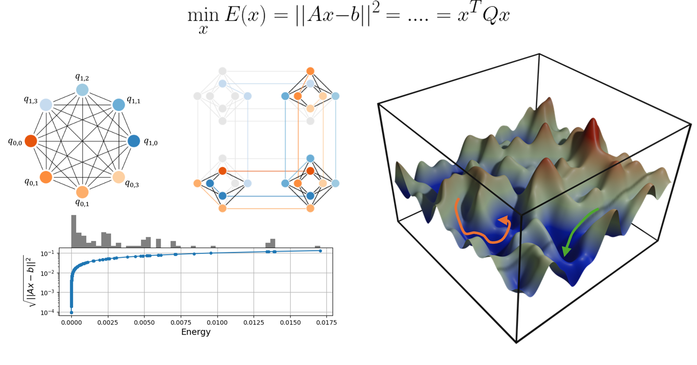

[](https://github.com/QuantumApplicationLab/qubols)
[](https://github.com/QuantumApplicationLab/qubols)
[](https://www.python.org/)
[](https://github.com/psf/black)
[](https://github.com/quantumapplicationlab/qubols/actions/workflows/build.yml)
[](https://coveralls.io/github/quantumapplicationlab/qubols?branch=main)




## QUBOLS

qubols allow to solve linear system of equations using a QUBO approach and to deploy this calculation on D`Wave hardware. See an example of use [here](./example/qubols.ipynb)

## Installation

To install qubols from GitHub repository, do:

```console
git clone https://github.com/QuantumApplicationLab/qubols.git
cd qubols
python3 -m pip install .
```

## Example

```python
import numpy as np
from qubols.qubols import QUBOLS
from qubols.encodings import RangedEfficientEncoding
from dwave.samplers import SimulatedAnnealingSampler

# define a symmetric matrix
size = 4
A = np.random.rand(size,size)
A = 0.1*(A+A.T)

# define the right hand side of the system
b =  np.random.rand(size,1)

# options of the qubols solver
options = {'num_reads':50, 'sampler':SimulatedAnnealingSampler(), 
           'encoding': RangedEfficientEncoding, 'num_qbits':4, 'range':10.0}

# create the solver
qubols= QUBOLS(options)

# solve the linear system
sol_num = qubols.solve(A, b)

```
## Contributing

If you want to contribute to the development of qubols,
have a look at the [contribution guidelines](CONTRIBUTING.md).

## Credits

This package was created with [Cookiecutter](https://github.com/audreyr/cookiecutter) and the [NLeSC/python-template](https://github.com/NLeSC/python-template).
